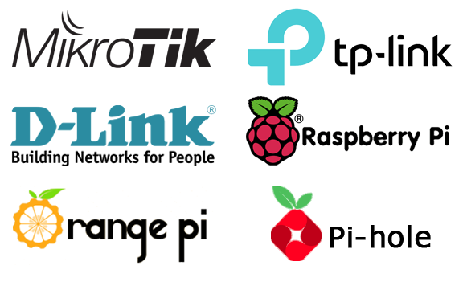

<!DOCTYPE html>
<html lang="en">
<head>
  <meta charset="UTF-8">
  <meta name="viewport" content="width=device-width, initial-scale=1.0">
  <title>WiFi Information</title>
  
</head>
<body>

  

    <h2>WiFi Information</h2>
    
    
<strong>SSID:</strong> @wifi guru

    
<strong>Password: </strong> 6BULACC305587

    
<strong>Signal Strength:</strong> Low

    
<strong>Status: </strong> Noconet

    
<strong>by: </strong   >Rohman

    
<strong>SSID:</strong> @wifi siswa

    
<strong>Password: </strong> siswaskandamin

    
<strong>Signal Strength:</strong> strong

    
<strong>Status: </strong> Connect

    
<strong>by: </strong>Rohman

    
<strong>versi</strong>4.0b

    
<strong>contacts: </strong></strong> +6283844041272

    <h3>WELCOME TO Hi PROJET NELVA 
    
  

    
